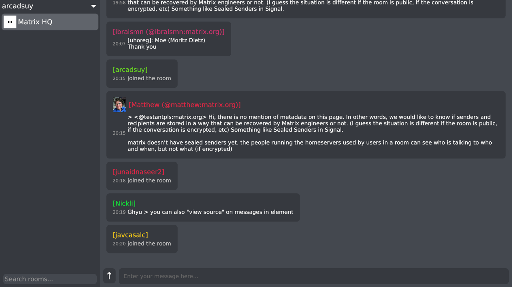
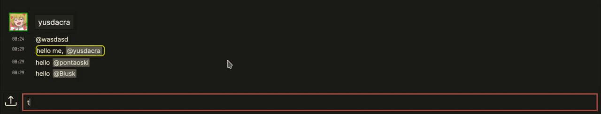

Crust is a [Harmony] client written in Rust using the [iced] GUI library.
It uses [harmony-rust-sdk] to communicate with Harmony servers.

Crust supports changing user_themes:

## Running

- Get a binary from one of the links below
    - [For Linux systems](https://github.com/harmony-development/Crust/releases/download/continuous/crust-linux)
    - [For Windows systems](https://github.com/harmony-development/Crust/releases/download/continuous/crust-windows.exe)
    - [For macOS systems](https://github.com/harmony-development/Crust/releases/download/continuous/crust-macos)
- Note: you might need to **mark the binary as executable** on macOS and Linux systems.
- Note: **Crust will not work if your system does not support Vulkan / DX12 (on Windows) / Metal (on MacOS)**.
Make sure your system has Vulkan setup if you are on Linux.

## Building

- Clone the repo, and switch the working directory to it: `git clone https://github.com/harmony-development/crust.git && cd crust`
- To build and run the project with debug info / checks use `cargo run`. Use `cargo run --release` for an optimized release build.

### Requirements
- Current stable Rust and Cargo.
- Make sure you have a working Vulkan setup.
- gcc, python3, pkg-config, cmake; protobuf, protoc, openssl, x11, xcb, freetype, fontconfig, expat, glib, gtk3, cairo, pango, atk, gdk_pixbuf libraries and development files.
- Above list may be incomplete, please find out what you need by looking at compiler errors.

### Nix
- `nix develop` to get a dev shell. (or `nix-shell nix/shell.nix` if you don't have flakes enabled)
- `nix build .#crust-debug` to compile a debug build.
- `nix build .#crust` to compile a release build.
- If you don't have flakes enabled, `nix-build` will give you a release build.

## Installing

### Nix
- For flakes: `nix profile install github:harmony-development/crust`
- For non-flakes: `nix-env -i -f "https://github.com/harmony-development/crust/tarball/master"`

[Harmony]: https://github.com/harmony-development
[harmony-rust-sdk]: https://github.com/harmony-development/harmony_rust_sdk
[iced]: https://github.com/hecrj/iced