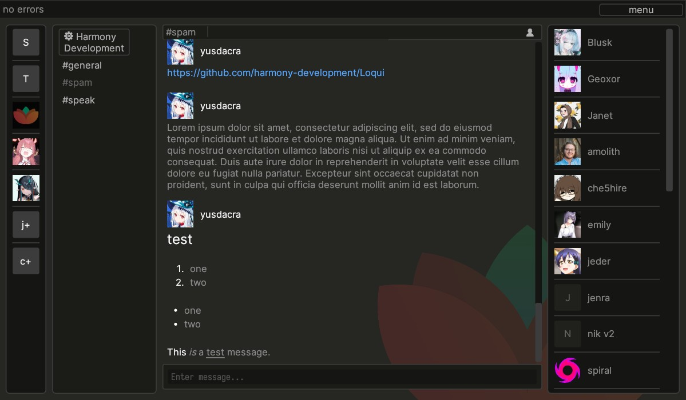

<h1 align="left" style="font-weight: bold;">Loqui</h1>

Loqui is a [Harmony] client written in Rust using the [egui] GUI library.
It uses [harmony-rust-sdk] to communicate with Harmony servers.

[See more screenshots](./screenshots)

Use it on your browser via https://loqui.harmonyapp.io 

## Roadmap

- Voice channels (needs implementation in `scherzo` server first)
- Video / audio files embedding
- Animated emotes / pfp / images support
- Instant (website) view (ala Telegram)
- UI & UX polish

## Features

- All essential chat functions Harmony provides
- User theming support
- Partial rich messages support (code, mentions, emotes, URLs)
- Website embeds (previews)

## Running

- Get a binary from one of the links below
    - [For Linux systems](https://github.com/harmony-development/Loqui/releases/download/continuous/loqui-linux)
    - [For Windows systems](https://github.com/harmony-development/Loqui/releases/download/continuous/loqui-windows.exe)
    - [For macOS systems](https://github.com/harmony-development/Loqui/releases/download/continuous/loqui-macos)
- Note: you might need to **mark the binary as executable** on macOS and Linux systems.

## Building

- Clone the repo, and switch the working directory to it: `git clone https://github.com/harmony-development/loqui.git && cd loqui`
- To build and run the project with debug info / checks use `cargo run`. Use `cargo run --release` for an optimized release build.

### Requirements
- Rust toolchain specified in the [rust-toolchain.toml](./rust-toolchain.toml) file.
This will be managed for you automatically if you have `rustup` setup.
- gcc, python3, pkg-config, cmake; protobuf, protoc, openssl, x11, xcb, freetype, fontconfig, expat, glib, gtk3, cairo, pango, atk, gdk_pixbuf libraries and development files.
- Above list may be incomplete, please find out what you need by looking at compiler errors.

### Nix
- `nix develop` to get a dev shell. (or `nix-shell nix/shell.nix` if you don't have flakes enabled)
- `nix build .#loqui-debug` to compile a debug build.
- `nix build .#loqui` to compile a release build.
- If you don't have flakes enabled, `nix-build` will give you a release build.

## Installing

### Nix
- For flakes: `nix profile install github:harmony-development/loqui`
- For non-flakes: `nix-env -i -f "https://github.com/harmony-development/loqui/tarball/master"`

[Harmony]: https://github.com/harmony-development
[harmony-rust-sdk]: https://github.com/harmony-development/harmony_rust_sdk
[egui]: https://github.com/emilk/egui